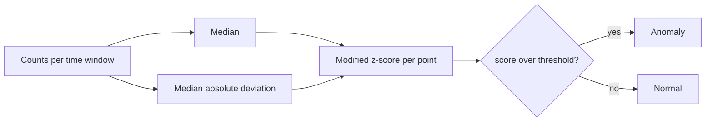

# log-anomaly-detector

> Catch the error spike in a log stream without drowning in false alarms

Counting log lines and alerting on a mean plus standard deviation falls apart the
moment one big spike lands, because that spike inflates the very threshold meant
to catch it. This uses the median and the median absolute deviation instead, so
the baseline stays stable and real spikes still stand out.

## What it looks like running

```
$ make demo
scanned 20 minutes, 2 anomalies
  minute  9: count= 40  score=24.956
  minute 14: count= 55  score=35.074
```

Twenty minutes of error counts sitting around 3, with two spikes planted at
minute 9 and 14. Both are caught, and the quiet minutes stay quiet.

## How it flows



## Getting started

```bash
pip install -r requirements-dev.txt
make demo      # scan an error count series with two spikes
make test      # full test suite
```

```python
from log_anomaly.detect import detect_anomalies

results = detect_anomalies(counts, threshold=3.5)
spikes = [r for r in results if r["is_anomaly"]]
```

Feed it any per-window counts: errors per minute, 5xx per second, failed logins
per hour. The threshold of 3.5 is the usual cutoff and is tunable.

**Stack:** Python · standard library · pytest

---

Built by [Krishna Gove](https://github.com/Krishna89287), working on AI and cloud infrastructure in Munich.
